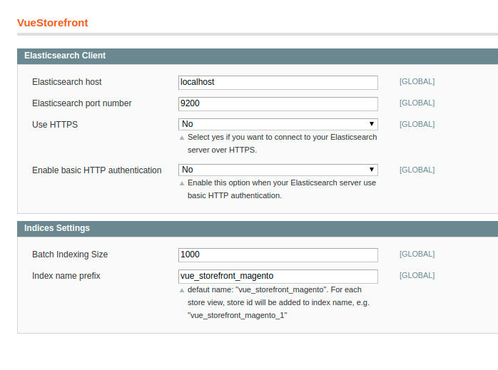

Divante VueStorefrontIndexer Extension
=====================
Facts
-----
- version: beta 1.0.0
- extension key: Divante_VueStorefrontIndexer

Description
-----------
This paragraph describes what the extension does.

Full synchronization: products, categories, attribute, tax rules, cms blocks.
Synchronization in real time for: products, categories, attributes, cms blocks.

Module listen on following events:
- product save (in backend panel),
- product deletion (in backend panel)
- mass product update,
- category save,
- category deletion,
- attribute save,
- attribute deletion (after attribute is removed full product synchronization will be fired),
- cms block save,
- cms block deletion.

Requirements
------------
- PHP >= 5.5.0
- Magento 1.9.*
- ElasticSearch 5.*
- ...

Compatibility
-------------
- Magento >= 1.9

Installation Instructions
-------------------------

### Setup ElasticSearch Connection

System --> Configuration -> VueStorefront -> Elasticsearch Client





### Change Indices Settings
System --> Configuration -> VueStorefront -> Indices Settings

- adjust indexing batch size to your data
- setup index name prefix. 

### Run full synchronization:

```
cd [magento root dir]/shell
php -f vsf_tools.php --action full_reindex
```

### Setup Cron job to update data in ElasticSearch in real time (for products, categories, attributes, cms blocks)

e.g.

```
*/5 * * * * cd [full path to magento directory]/shell && /usr/bin/flock -n /tmp/vsf_index.lock  /usr/bin/php vsf_tools.php --action reindex 
```

Support
-------

Licence
-------

Copyright
---------
(c) 2018 Divante