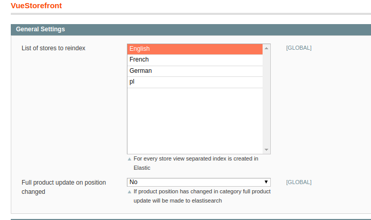
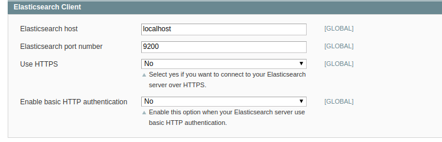
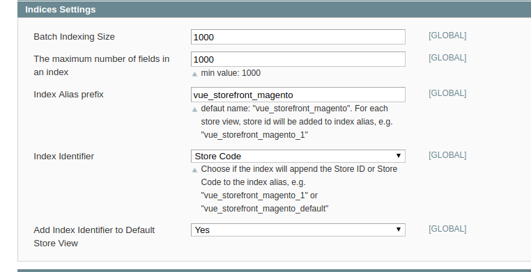
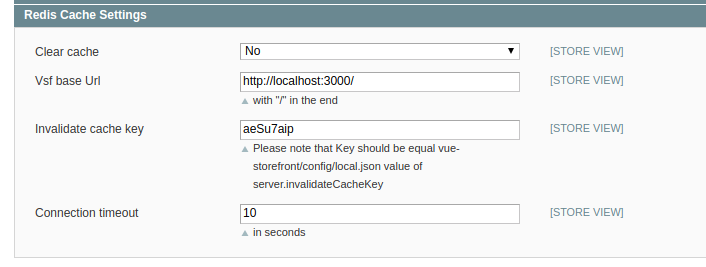
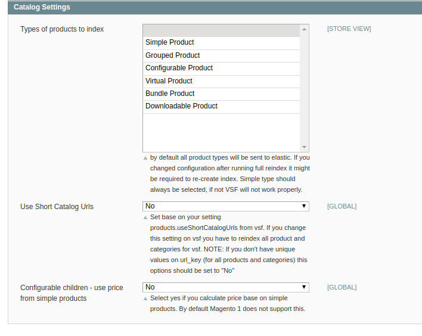

# Divante VueStorefrontIndexer Extension for Magento1


<a href="https://join.slack.com/t/vuestorefront/shared_invite/enQtMzA4MTM2NTE5NjM2LTI1M2RmOWIyOTk0MzFlMDU3YzJlYzcyYzNiNjUyZWJiMTZjZjc3MjRlYmE5ZWQ1YWRhNTQyM2ZjN2ZkMzZlNTg"></a>

This projects is a native, Magento1 data indexer for [Vue Storefront - first Progressive Web App for e-Commerce](https://github.com/DivanteLtd/vue-storefront). It fills the ElasticSearch data index with all the products, categories and static information required by Vue Storefront to work.

Vue Storefront is a standalone PWA storefront for your eCommerce, possible to connect with any eCommerce backend (eg. Magento, Pimcore, Prestashop or Shopware) through the API.

**Please note:** This indexer is a part of [magento1-vsbridge](https://github.com/DivanteLtd/magento1-vsbridge) connector for Magento1.

 ## Video demo
 [](https://www.youtube.com/watch?v=L4K-mq9JoaQ)
Sign up for a demo at https://vuestorefront.io/ (Vue Storefront integrated with Pimcore OR Magento2).


## Facts
- version: beta 1.0.0
- extension key: Divante_VueStorefrontIndexer

## Features
This module is in beta, however we've used it in some production sites already. Please do feel free to test it and bring Your feedback + Pull Requests :)

Full synchronization: products, categories, attribute, tax rules, cms blocks.
Synchronization in real time for: products, categories, attributes, cms blocks.

Module listen on following Magento1 events:
- product save (in backend panel),
- product deletion (in backend panel)
- mass product update,
- category save,
- category deletion,
- attribute save,
- attribute deletion (after attribute is removed full product synchronization will be fired),
- cms block save,
- cms block deletion.

## Requirements
- PHP >= 5.5.0
- Magento 1.9.*
- ElasticSearch 5.*
- ...

## Compatibility
- Magento >= 1.9
- Vue Storefront >= 1.7

## Installation Instructions/Getting Stared

### Install Magento Module
- Install Magento module Divante_VueStorefrontIndexer using modman or by coping code from src/
- Configure the module in Magento admin panel and run full indexation

### Configuration
Go to the new ‘Indexer’ section (Stores → Configuration → Vuestorefront → Indexer), available now in the in the Magento Panel, and configure it in the listed areas: 
 
1. General settings → List of stores to reindex
 
   Select stores for which data must be exported to ElasticSearch. By default stores 0 to 1 are selected. For each store view, a new, separate ElasticSearch index is created.

    

1. Elasticsearch Client

   Configure connection with ElasticSearch. Provide a host, port, and set up login and password (optionally).

   

1. Indices settings
 
   Batch Indexing Size → select size of packages by which you intend to send data to ElasticSrearch. Depending on the project you might need to adjust package size to the number of products, attributes, configurable products variation, etc). By default Batch, Indexing Size is set up for 1000.
   Indicies settings. Adjust indexing batch size to your data.
    
   Index Name Prefix → define prefixes for ElasticSearch indexes. The panel allows adding prefix only to the catalog name e.g.: "vue_storefront_catalog". For each store (store view) index name is generated on the base of defined prefix and ID. Aliases cannot be created. 
 
   Example: When we define following indexes: "vue_storefront_catalog_1", "vue_storefront_catalog_2", "vue_storefront_catalog_3", their name will remain unchanged, and only product and category names will be updated. 
   Important: It is crucial to update this configuration in the VSF and VSF-API (one change at the beginning of the whole configuration process).   
   
   
   The maximum number of fields in an index -> allow to setup value for option `index.mapping.total_fields.limit` 
   
1. Redis Cache Settings

    Clear cache → No/Yes (by default this option is disabled)
    
    VSF base Url → URL for VSF
 
    Invalidate Secret cache key → provide the same value as in the VSF configuration
 
    Connection timeout → by default set up for 10 seconds
    
     

1. Catalog Settings
    
    Use Short Catalog Urls → by default this option is disabled. The short Catalog Urls must be aligned with the VSF configuration. After any changes in the VSF configuration, the configuration in the Magento Panel must be updated and all products and categories indexed anew.
        
    Types of products to index → by default all product will be exported to ElasticSearch. This option allows for selecting certain product types that should be exported. 
    
    


After updating the configuration, you can run the indexation. It is also worth query ElasticSearch using CURL, to be sure that the communication works.

### Indexation

You can run full synchronization (for products, categories, attributes, cms blocks) or for specific type.

### Run full synchronization for chosen store views:

```
cd [magento root dir]/shell
php -f vsf_tools.php -- --action full_reindex --store STORE_ID
```

### Run full synchronization for specific type

```
cd [magento root dir]/shell
php -f vsf_tools.php -- --action full_reindex --store STORE_ID --type [taxrules|products|categories|attributes|cms_blocks]

php -f vsf_tools.php -- --action full_reindex --store STORE_ID --type attributes
```

It is worth, to begin with taxrules as it is the fastest.


### Setup Cron job to update data in ElasticSearch in real time (for products, categories, attributes, cms blocks)

e.g.

```
*/5 * * * * cd [full path to magento directory]/shell && /usr/bin/flock -n /tmp/vsf_index.lock  /usr/bin/php vsf_tools.php --action reindex 
```

## Support

[Join our Slack channel](http://slack.vuestorefront.io)


## Licence

MIT


Copyright
---------
(c) 2018 Divante
